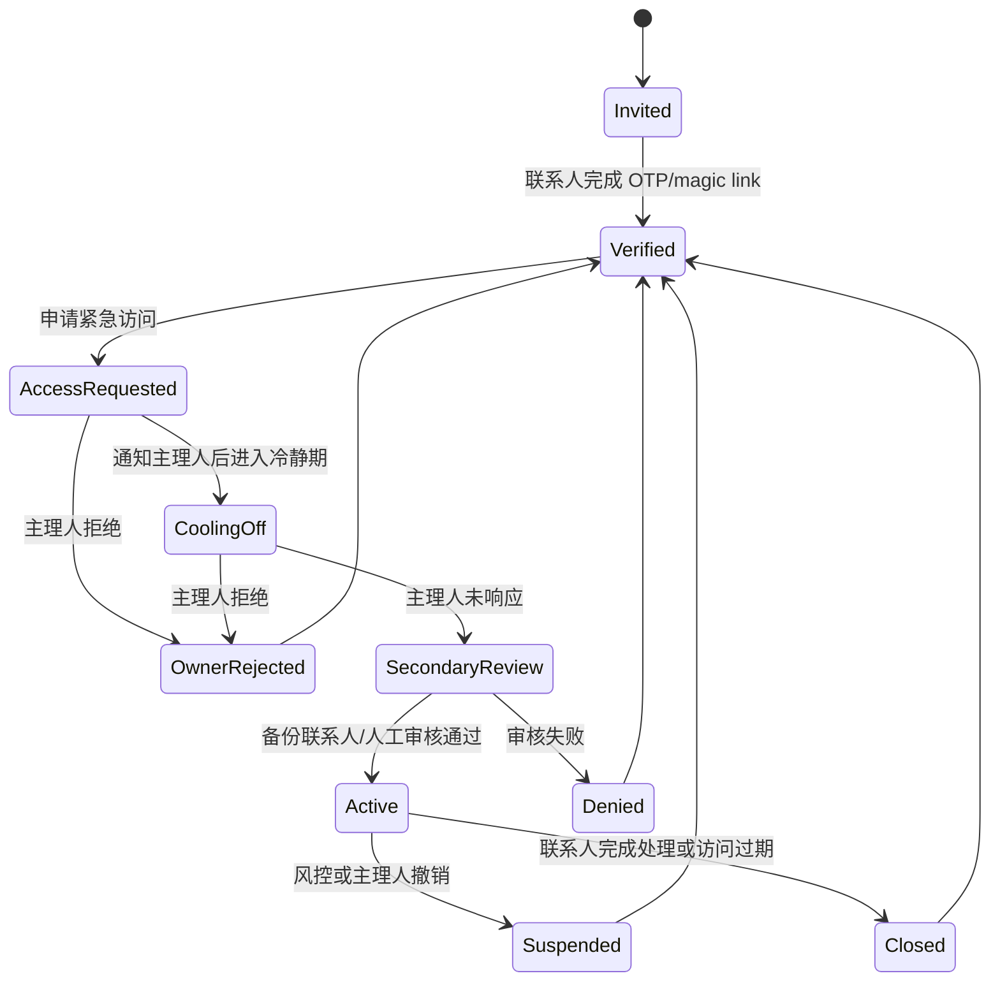

# 紧急联系人登录与主理人资料访问设计

> 目标：让主理人指定的紧急联系人在主理人出事或长期失联后，可以登录 Pusaka 查看必要资料并协助家人处理下一步。
> 本文是产品与技术设计稿，后续开发以此为准。

## 1. 设计结论

建议把该能力定义为 **Emergency Contact Access（紧急联系人访问）**，而不是简单的“联系人登录查看资料”。

核心原则：

- **先验证身份，再验证事件，再分级披露资料**。
- v1 只展示“能帮助处理事情的信息”：主理人预留说明、家庭成员概览、信任联系人顺序、资产/文件位置线索、下一步清单。
- 继续坚持现有 PRD 边界：**不存、不展示密码、余额、完整账号、私钥、助记词**。
- 每次触发、查看、导出、关闭访问都必须有审计记录；未来可把关键事件做链上哈希存证。
- 主理人仍在世且可响应时，必须给主理人通知、确认或撤销机会。

## 2. 角色定义

| 角色 | 说明 | 权限 |
|---|---|---|
| 主理人 | 创建家庭计划的人，对资料拥有控制权 | 管理家庭成员、资产线索、紧急联系人、触发规则、披露范围 |
| 紧急联系人 | 被主理人指定的人，可在紧急情境中申请访问 | 通过验证后查看被授权的紧急移交资料 |
| 备份联系人 | 主理人指定的第二联系人 | 可参与二次确认，也可在主联系人不可用时接管 |
| 家庭成员 | 计划保护对象 | v1 只作为资料上下文，不默认拥有系统登录权限 |
| Pusaka 平台 | 访问控制、通知、审计、合规边界执行者 | 不替用户做法律/财务决策 |

## 3. 触发模式

v1 建议支持两种触发方式，先实现人工可控流程，后续再自动化。

### 3.1 主理人主动演练或授权

用于“我想让联系人提前确认自己能登录”和家庭演练。

流程：

1. 主理人在 App 中邀请紧急联系人。
2. 联系人通过短信/邮件 magic link 或 OTP 注册/登录。
3. 联系人完成手机号/邮箱验证。
4. 主理人看到联系人状态变为 `VERIFIED`。
5. 联系人平时只能看到“你已被指定为联系人”和演练说明，不看到主理人资料。

### 3.2 紧急事件申请访问

用于真实事故、病重、失联等场景。

流程：

1. 联系人登录后选择“申请紧急访问”。
2. 系统展示严肃确认文案：该流程仅用于主理人无法自行处理事务的情形。
3. 联系人选择原因：`事故/身故/重病/长期失联/其他`，填写简短说明。
4. 系统通知主理人：App push + email + SMS。
5. 冷静期开始，建议默认 24 小时；主理人可立即拒绝。
6. 若主理人未响应，根据主理人预设规则进入二次确认：
   - v1 推荐：备份联系人确认一次，或平台人工审核一次。
   - 后续：加入医疗/死亡证明上传、多联系人多签、链上存证。
7. 访问开启，联系人进入紧急模式。

## 4. 访问状态机



## 5. 资料披露范围

### 5.1 v1 可展示

| 类别 | 内容 | 来源 |
|---|---|---|
| 主理人身份 | 姓名、可选头像、最后确认计划时间 | `User` + review/check-in |
| 主理人留言 | “如果你看到这段话，请先联系谁、去哪找文件” | 新增 handover instruction |
| 家庭成员 | 姓名、关系、备注中的非敏感说明 | `FamilyMember` |
| 联系人顺序 | 主联系人、备份联系人、电话、邮箱 | `TrustedContact` |
| 资产线索 | 类别、名称、位置提示、是否已记录位置 | `AssetReference` |
| 下一步清单 | 根据资料生成的固定规则步骤 | handover builder |
| 合规提示 | 非法律/财务建议，不展示秘密信息 | 静态文案 |

### 5.2 v1 不展示

- 密码、登录凭据、私钥、助记词。
- 银行完整账号、余额、交易记录、保单完整号码。
- 主理人未明确授权给紧急联系人的私密备注。
- AI 生成的法律/财务判断。
- 未通过验证的云盘文件内容；v1 只展示“去哪找”，不代理打开文件。

### 5.3 分级披露建议

| 层级 | 名称 | 触发条件 | 可见信息 |
|---|---|---|---|
| Level 0 | 被指定状态 | 联系人已验证 | 只显示“你是某人的紧急联系人” |
| Level 1 | 演练预览 | 主理人主动开启 | 示例流程、自己的联系方式确认 |
| Level 2 | 紧急只读访问 | 紧急申请通过 | 主理人留言、联系人、家庭成员、资产位置线索 |
| Level 3 | 强验证资料包 | 后续版本 | 可能包含更详细文件索引，需多签/人工审核/法律文件 |

v1 只实现 Level 0、Level 1、Level 2。

## 6. App 信息架构

### 6.1 主理人侧

新增或强化页面：

- `Trusted contacts`：邀请联系人、查看验证状态、重发邀请、撤销联系人。
- `Emergency access settings`：设置冷静期、是否需要备份联系人确认、访问有效期。
- `Handover message`：主理人写给联系人的短说明。
- `Emergency preview`：继续保留现在的预览，但标注“联系人实际看到的版本”。
- `Access history`：查看谁申请过、何时查看、是否导出。

主理人侧关键文案：

- “Pusaka only shares locations and instructions, never passwords or balances.”
- “Your trusted contacts can request access only after identity verification and emergency review.”

### 6.2 紧急联系人侧

联系人登录后进入独立模式，不进入主理人的普通 App tab。

### 6.3 真实入口设计（WB-57）

v1 的真实入口放在登录页主流程下方：

- 主按钮继续保留给主理人：`Continue with email`。
- 登录页增加次级入口：`I am an emergency contact`。
- 联系人点击后，页面切换为“紧急联系人登录语境”，但仍复用同一套 email OTP 登录。
- 联系人必须使用主理人邀请时填写的邮箱登录；登录成功后跳转到 `/contact-emergency`。
- 普通主理人登录成功后仍进入 `/home`，不改变现有路径。

入口文案原则：

- 不把紧急联系人入口藏在 Account 或 Plan 页面里，因为联系人通常还没有主理人账号上下文。
- 不让未登录联系人直接查看资料；入口只是选择登录意图，资料访问仍由后端验证 `TrustedContact` 绑定和 emergency access 状态。
- 联系人模式入口要清楚说明：登录后若没有已验证 assignment，只会看到“未被验证为紧急联系人”的状态。

页面流：

1. `Contact Home`
   - 显示“你是 Aisyah Rahman 指定的紧急联系人”
   - 状态：已验证 / 可申请访问 / 访问已开启
2. `Request Emergency Access`
   - 选择原因
   - 填写说明
   - 严肃确认 checkbox
3. `Waiting for Review`
   - 显示通知已发送、冷静期剩余、下一步
4. `Emergency Mode`
   - 深色、克制、低焦虑界面，沿用现有 `emergency-1` 到 `emergency-5` 原型方向
5. `Contacts & First Steps`
   - 联系顺序、主理人留言、下一步清单
6. `Where to Look`
   - 资产/文件位置线索，按类别分组
7. `Close Access`
   - 联系人可主动声明处理完成，访问转为关闭

## 7. 后端设计

现有后端已有 `trusted-contacts`、`handover`、`auth` 模块。建议新增两个领域模块，而不是把逻辑塞进现有 CRUD：

```text
emergency-access/
├── emergency-access.schema.ts
├── emergency-access.repository.ts
├── emergency-access.service.ts
└── emergency-access.routes.ts

handover-instructions/
├── handover-instruction.schema.ts
├── handover-instruction.repository.ts
├── handover-instruction.service.ts
└── handover-instruction.routes.ts
```

### 7.1 建议 Prisma 模型

```prisma
enum EmergencyAccessStatus {
  REQUESTED
  COOLING_OFF
  SECONDARY_REVIEW
  ACTIVE
  DENIED
  REJECTED_BY_OWNER
  SUSPENDED
  CLOSED
  EXPIRED
}

enum EmergencyAccessReason {
  ACCIDENT
  DEATH
  SERIOUS_ILLNESS
  UNREACHABLE
  OTHER
}

model HandoverInstruction {
  id        String   @id @default(uuid())
  userId    String   @unique
  message   String?
  firstSteps String[]
  createdAt DateTime @default(now())
  updatedAt DateTime @updatedAt
  user      User     @relation(fields: [userId], references: [id], onDelete: Cascade)

  @@map("handover_instructions")
}

model EmergencyAccessRequest {
  id                 String                @id @default(uuid())
  ownerUserId         String
  trustedContactId    String
  requesterUserId     String?
  reason             EmergencyAccessReason
  reasonDetail        String?
  status             EmergencyAccessStatus @default(REQUESTED)
  ownerNotifiedAt     DateTime?
  coolingOffEndsAt    DateTime?
  activatedAt         DateTime?
  expiresAt           DateTime?
  closedAt            DateTime?
  createdAt           DateTime              @default(now())
  updatedAt           DateTime              @updatedAt

  @@index([ownerUserId, status])
  @@index([trustedContactId, status])
  @@map("emergency_access_requests")
}

model EmergencyAccessAuditEvent {
  id              String   @id @default(uuid())
  accessRequestId String
  actorUserId      String?
  eventType       String
  metadata        Json?
  createdAt       DateTime @default(now())

  @@index([accessRequestId, createdAt])
  @@map("emergency_access_audit_events")
}
```

说明：

- `TrustedContact` 后续需要增加 `contactUserId String?`，用于把被邀请联系人和实际登录用户绑定。
- 当前 `TrustedContact.verificationStatus` 可继续使用，但应只代表“联系方式/身份已确认”，不代表已获资料访问权。
- v1 可先把 `HandoverInstruction.firstSteps` 做成字符串数组；后续如需排序、勾选、责任人，再拆独立表。

### 7.2 API 草案

主理人侧：

| 方法 | 路径 | 说明 |
|---|---|---|
| GET | `/api/handover-instruction` | 获取自己的移交说明 |
| PUT | `/api/handover-instruction` | 保存留言和第一步清单 |
| GET | `/api/emergency-access/owner/requests` | 查看访问申请历史 |
| POST | `/api/emergency-access/owner/requests/:id/reject` | 拒绝申请 |
| POST | `/api/emergency-access/owner/requests/:id/revoke` | 撤销已开启访问 |

联系人侧：

| 方法 | 路径 | 说明 |
|---|---|---|
| GET | `/api/emergency-access/contact/context` | 获取自己被指定为哪些计划的联系人 |
| POST | `/api/emergency-access/contact/requests` | 申请紧急访问 |
| GET | `/api/emergency-access/contact/requests/:id` | 查看申请状态 |
| GET | `/api/emergency-access/contact/requests/:id/handover` | 访问开启后获取只读资料 |
| POST | `/api/emergency-access/contact/requests/:id/close` | 联系人关闭本次访问 |

所有接口继续使用统一响应信封：

```typescript
res.status(2xx).json({ success: true, data })
res.status(4xx/5xx).json({ success: false, error })
```

### 7.3 授权规则

- 普通 `requireAuth` 只能证明用户已登录，不能证明用户可查看某个主理人的资料。
- 紧急访问接口必须额外检查：
  - 当前登录用户是否绑定到对应 `TrustedContact.contactUserId`。
  - `TrustedContact.verificationStatus === VERIFIED`。
  - 是否存在 `ACTIVE` 且未过期的 `EmergencyAccessRequest`。
  - 请求的 owner 是否等于该 trusted contact 的 `userId`。
- handover builder 应增加“联系人访问模式”，继续过滤敏感字段。

## 8. 通知与审计

### 8.1 通知

v1 最低要求：

- 联系人申请访问后通知主理人：push + email；SMS 作为高优先级增强。
- 申请进入二次确认时通知备份联系人。
- 访问开启后通知主理人和所有已验证联系人。
- 访问即将过期前通知当前联系人。

### 8.2 审计事件

必须记录：

- 联系人完成验证。
- 联系人申请访问。
- 系统通知主理人。
- 主理人拒绝/撤销。
- 备份联系人确认/拒绝。
- 访问开启、查看 handover、导出/分享、关闭、过期。

审计日志中不要存储敏感明文，只存事件类型、actor、request id、时间和必要 metadata。

## 9. 安全与合规边界

- 联系人访问是高敏感功能，必须强制速率限制和异常访问风控。
- `reasonDetail`、留言、first steps 都属于用户输入，必须 Zod 校验长度并做前端展示转义。
- 访问令牌不应通过长期 URL token 暴露；magic link 只用于登录/绑定身份，资料访问仍走会话与后端授权。
- 紧急访问资料包只读，v1 不允许联系人修改主理人资料。
- 数据保留：访问申请和审计日志需有保留策略，注销账户时按合规策略处理。
- 合规提示必须清楚说明：Pusaka 提供资料整理和移交指引，不提供法律、财务、保险建议。
- 若后续接入云盘文件内容，必须重新做授权、跨境传输、第三方数据处理和撤回同意设计。

## 10. MVP 拆分建议

### Milestone 1：联系人身份绑定

- 为 `TrustedContact` 增加 `contactUserId`。
- 邀请/验证流程跑通。
- 联系人登录后看到 Level 0 页面。
- 主理人可看到联系人已验证。

### Milestone 2：主理人移交说明

- 新增 `HandoverInstruction`。
- 主理人可编辑留言和 first steps。
- 现有 emergency preview 引入主理人留言。
- 单元测试覆盖 builder 不泄露敏感 detail。

### Milestone 3：紧急访问申请

- 新增 `EmergencyAccessRequest` 和审计事件。
- 联系人可申请访问。
- 主理人可收到/查看/拒绝。
- 冷静期和状态机在 service 层实现。

### Milestone 4：只读紧急模式

- 联系人访问 `ACTIVE` 请求下的 handover 资料。
- App 增加联系人侧 Emergency Mode。
- 访问过期/关闭/撤销流程完成。
- 集成测试覆盖越权访问、未验证访问、过期访问。

### Milestone 5：二次确认与存证增强

- 备份联系人确认。
- 关键事件哈希存证。
- 更完整通知渠道和导出水印。

## 11. 开放问题

- v1 冷静期默认是否为 24 小时，还是允许主理人选择 6/12/24/48 小时？
- 如果只有一个联系人，是否允许紧急访问开启，还是必须平台人工审核？
- 主理人长期失联的自动触发条件是否沿用“12 个月未活动”，还是单独设置？
- 联系人是否可以下载 PDF 资料包？若允许，需要水印、过期标识和导出审计。
- 是否需要区分“家庭成员可见”和“紧急联系人可见”两套披露范围？

## 12. 推荐的 v1 产品口径

对用户：

> Pusaka lets your trusted contacts see where to look and who to call in an emergency. It does not store or reveal passwords, balances, account numbers, private keys, or legal advice.

对紧急联系人：

> You are seeing this because the planner named you as a trusted contact and emergency access was verified. Use this to coordinate the family, find records, and contact the right people.

中文口径：

> Pusaka 会在紧急情况下帮助可信联系人知道“先联系谁、去哪找资料、下一步做什么”。它不会保存或展示密码、余额、完整账号、私钥，也不会替代法律或财务建议。
